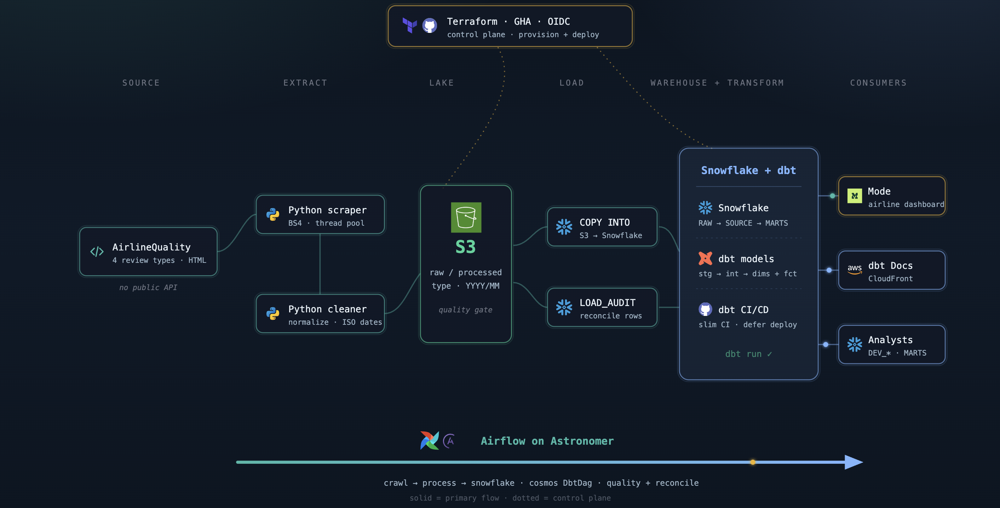

# Skytrax Reviews Analytics Platform

End-to-end airline review analytics: scrape AirlineQuality.com → stage on S3 → load Snowflake → dbt star schema (medallion) → Mode dashboards.

> **Source status:** [AirlineQuality.com](https://www.airlinequality.com/) (Skytrax) is **permanently closed**. This platform was built from historical scrapes collected while the site was live; the EL path is a replayable S3/Snowflake archive, not an ongoing feed from that domain.

This repo is the **umbrella** — project narrative, architecture, and links into the part repos. Implementation lives in the extract-load, transformation, and dashboard repositories below.

**[Platform walkthrough](https://markphamm.github.io/skytrax_reviews/)** — Show → Why → What-if deck (`index.html`) covering modeling, transformation, governance, insight, and DataOps.

**[Demo runbook](docs/demo-runbook.md)** — live commands per pillar (including break-it-live branches `demo/contract-break` and `demo/bad-data` on the transformation repo).

> **Self-selection bias:** Skytrax reviews are self-reported. Passengers with extreme experiences are more likely to post, so KPIs are *directional*, not population-level.

---

## Repositories

| Part | Repository | Owner | Purpose |
| --- | --- | --- | --- |
| 1 · Extract & Load | **[skytrax_reviews_extract_load](https://github.com/MarkPhamm/skytrax_reviews_extract_load)** | MarkPhamm | Scrape 4 review types → S3 (`raw/` / `processed/`) → Snowflake `COPY INTO` + quality gates + Terraform |
| 2 · Transform & DataOps | **[skytrax_reviews_transformation](https://github.com/MarkPhamm/skytrax_reviews_transformation)** | MarkPhamm | dbt Kimball star schema, incremental fact, slim CI/CD, OIDC, Terraform RBAC, hosted dbt docs |
| 3 · Insight · Delta | **[airline_customer_exp_analysis](https://github.com/alyssaqle/airline_customer_exp_analysis)** | alyssaqle | Mode dashboard — Delta cabin-class satisfaction drivers |
| 3 · Insight · Frontier | **[frontier-reviews-dashboard](https://github.com/gwenniehub/frontier-reviews-dashboard)** | gwenniehub | Mode dashboard — Frontier ULCC peer benchmark |
| 3 · Insight · Spirit | **[spirit_airlines_dashboard](https://github.com/MiaTran1112/spirit_airlines_dashboard)** | MiaTran1112 | Mode dashboard — Spirit chronic dissatisfaction deep-dive |
| — | **[Skytrax_Reviews_Dashboard](https://github.com/nguyentienTCU/Skytrax_Reviews_Dashboard)** | nguyentienTCU | Broader Next.js dashboard / explorer (parallel viz surface) |

**Live dbt docs:** [https://d38l3fc9bckvbz.cloudfront.net](https://d38l3fc9bckvbz.cloudfront.net/#!/overview/ba_transformation?g_v=1)

---

## North-star metrics

Same governed logic in dbt (`average_rating`, `rating_band`, `recommended`) on `MARTS.FCT_REVIEW` / `FCT_REVIEW_ENRICHED` — three Mode slices, three business levers:

| Carrier | Reviews | Avg rating | Would recommend | Distinctive signal |
| --- | --- | --- | --- | --- |
| **Delta** | 2,853 (2010–2023) | **2.48 / 5** | **28.8%** | Economy vs Premium drivers diverge |
| **Frontier** | ~3,000 (2015–2025) | ~**1.3** inflight | ~**2%** recent | Lowest ULCC recommendation rate vs peers |
| **Spirit** | 4,671 (2015–2025) | **1.59 / 5** | **12.1%** | Chronic dissatisfaction; IFE/Wi‑Fi ~1.1 |

---

## Architecture

<p align="center">
  
</p>

```text
Source                 Extract              Lake                 Load                 Warehouse + Transform              Consumers
────────               ───────              ────                 ────                 ────────────────────              ─────────
AirlineQuality.com  →  Python scraper  →   S3 raw/<type>/   →  COPY INTO        →   Snowflake RAW                   →  Mode (Delta · Frontier · Spirit)
  (site closed;          + cleaner            processed/<type>/   + LOAD_AUDIT         SOURCE → INTERMEDIATE → MARTS      dbt Docs (CloudFront)
   historical HTML)      (Airflow tasks)      quality gate                             dbt: stg → int → dims + fct        Analyst DEV_* 

Orchestration (spans extract → load → transform)
  Airflow (Astronomer) · Dataset-chained crawl → process → snowflake · cosmos DbtDag

Control plane (provisions + ships)
  Terraform (AWS + Snowflake) · GitHub Actions slim CI / defer-favor-state CD · OIDC (keyless GHA → AWS)
```

### Medallion mapping

| Layer | Where | What |
| --- | --- | --- |
| Bronze | S3 + `RAW` | Landed files + warehouse raw tables (`AIRLINE_REVIEWS`, …, `LOAD_AUDIT`) |
| Silver | `SOURCE` → `INTERMEDIATE` | Staging views (dedup, hash keys) + cleaned business logic |
| Gold | `MARTS` | Star schema dims + incremental `fct_review` + `fct_review_enriched` for BI |

---

## Stack

| Layer | Technology | Why |
| --- | --- | --- |
| Extract | Python 3.12, BeautifulSoup, pandas | No public API — custom scrape of AirlineQuality.com (site now permanently closed; historical archive) |
| Orchestration | Apache Airflow (Astronomer) + Datasets + cosmos | Event-driven DAG chaining; dbt as first-class tasks |
| Lake | AWS S3 (type + date partitions) | Replayable, cheap, decoupled from Snowflake |
| Warehouse | Snowflake | `COPY INTO`, RBAC, tag-based masking, separate compute |
| Transform | dbt Core (dbt-snowflake), SQLFluff | Tests, contracts, incremental, defer/state, docs |
| BI | Mode Analytics | Warehouse-direct SQL; Delta / Frontier / Spirit Mode slices on the same marts |
| IaC | Terraform (AWS + Snowflake) | S3, IAM, CloudFront, OIDC, schemas, warehouses, roles, masking |
| CI/CD | GitHub Actions | Slim CI (`state:modified+`); CD `--defer --favor-state` |
| Auth | AWS IAM OIDC | Keyless GHA → artifact bucket / CloudFront invalidate |

---

## Part 1 — Extract & Load

**Repo:** [skytrax_reviews_extract_load](https://github.com/MarkPhamm/skytrax_reviews_extract_load)

Three Airflow DAGs chained via **Datasets** (no cron guesswork between stages):

| DAG | Trigger | What it does |
| --- | --- | --- |
| `skytrax_crawl` | Daily schedule (or `full_scrape=True`) | Scrapes 4 review types with per-entity parallelism → S3 `raw/` |
| `skytrax_process` | Dataset `raw` | Clean → upload `processed/` → validate (schema / null-rate / ratings) |
| `skytrax_snowflake` | Dataset `processed` | `COPY INTO` per type (skips quality-rejected dates) + reconcile → `LOAD_AUDIT` |

**S3 layout**

```text
s3://skytrax-reviews-landing-<account-id>/
  raw/<type>/YYYY/MM/raw_data_YYYYMMDD.csv
  processed/<type>/YYYY/MM/clean_data_YYYYMMDD.csv
```

`<type>` ∈ `airlines` | `seats` | `lounges` | `airports`

- Versioning, AES256, lifecycle (IA after 30d), public access blocked
- Idempotent daily files + Snowflake file-level `COPY INTO` dedupe
- PII: tag-based masking on `CUSTOMER_NAME` / `NATIONALITY` (Terraform)
- All landing + RAW objects managed with Terraform

---

## Part 2 — Transformation & DataOps

**Repo:** [skytrax_reviews_transformation](https://github.com/MarkPhamm/skytrax_reviews_transformation)

### Star schema (Kimball)

**Grain:** one row per customer review submission.

| Model | Type | Description |
| --- | --- | --- |
| `fct_review` | Fact (incremental merge) | Ratings, `average_rating`, `rating_band`, FKs to dims |
| `fct_review_enriched` | BI view | Denormalized labels for Mode |
| `dim_customer` | Dimension | Reviewer (+ PII hash mask for analysts) |
| `dim_airline` | Dimension | Airline |
| `dim_aircraft` | Dimension | Model, manufacturer, capacity |
| `dim_location` | Dimension | City + airport (role-playing: origin / dest / transit) |
| `dim_date` | Dimension | Calendar + fiscal (role-playing: submitted / flown) |

### Schemas (Terraform)

| Schema | Purpose |
| --- | --- |
| `RAW` | From Part 1 |
| `SOURCE` | Staging views |
| `INTERMEDIATE` | Cleaned logic |
| `MARTS` | Dims + facts |
| `STAGING` | CI scratch |
| `DEV_*` | Per-user local sandboxes |

### CI/CD + OIDC

- **CI (PR):** merge-base state → SQLFluff → `dbt clone` → build/test `state:modified+` / `state:new+`
- **CD (main):** OIDC → download prod manifest → `dbt build --select state:modified+ --defer --favor-state` → upload docs/manifest to S3 → CloudFront invalidate
- **IaC:** Snowflake RBAC/warehouses/schemas + AWS artifacts bucket, CloudFront, OIDC provider — all Terraform

---

## Part 3 — Insight

Same marts (`FCT_REVIEW_ENRICHED`), three Mode dashboards — each with one distinctive insight and one action.

### Delta — cabin-class drivers

**Repo:** [airline_customer_exp_analysis](https://github.com/alyssaqle/airline_customer_exp_analysis) (Mode)

| Signal | Value |
| --- | --- |
| Reviews (2010–2023) | 2,853 |
| Average rating | **2.48 / 5** |
| Would recommend | **28.8%** |
| Insight | Economy vs Premium satisfaction drivers diverge (Economy → staff / food / value; Premium → seat / dining / value) |
| Action | Cabin-specific plays: keep staff strength; fix Wi‑Fi; Economy value/pitch; Premium dining/comfort at ATL / JFK / LAX |

### Frontier — ULCC peer gap

**Repo:** [frontier-reviews-dashboard](https://github.com/gwenniehub/frontier-reviews-dashboard) (Mode)

| Signal | Value |
| --- | --- |
| Reviews (2015–2025) | ~3,000 |
| Avg inflight service | ~**1.3** |
| Would recommend (recent) | ~**2%** |
| Insight | Among ULCCs, Frontier underperforms peers on recommendation rate (Allegiant > Spirit > Frontier) |
| Action | Close the ULCC value gap: prioritize Economy entertainment + seat comfort (majority of volume) |

### Spirit — chronic dissatisfaction

**Repo:** [spirit_airlines_dashboard](https://github.com/MiaTran1112/spirit_airlines_dashboard) (Mode)

| Signal | Value |
| --- | --- |
| Reviews (2015–2025) | 4,671 |
| Average rating | **1.59 / 5** |
| Not recommended | **~87.9%** |
| Insight | Chronic dissatisfaction; IFE/Wi‑Fi ~1.1; Business Class the worst segment |
| Action | Connectivity/IFE SLAs, rebuild Business value prop, airport ops at MIA / MEX / GOT |

---

## Governance (cross-cutting)

| Concern | Where |
| --- | --- |
| File quality gates | EL — validate after upload; quarantine bad dates |
| Load reconciliation | EL — `RAW.LOAD_AUDIT` |
| dbt tests | unique / not_null / relationships / accepted_values / expectations + unit + singular |
| Source freshness | warn 3d / error 7d on `updated_at` (laptop-paced loads) |
| PII | Snowflake masking (RAW tags + marts `PII_HASH_MASK` on `dim_customer`) |
| Access | Terraform RBAC: ADMIN > TRANSFORMER + ANALYST; service users `PROD_DBT`, `DBT_CICD` |

---

## Team

### Leadership

* **Mentor / Stakeholder:** [Nhan Tran](https://www.linkedin.com/in/panicpotatoe/)
* **Team Lead / Analytics Engineer:** [Mark Pham](https://www.linkedin.com/in/minhbphamm/)

### Members

* **Data Analysts:** [Trang Dam](https://www.linkedin.com/in/thuytrangdam/), [Gwennie Nguyen](https://www.linkedin.com/in/gwennienguyen/), [Jenny Tran](https://www.linkedin.com/in/jennytranuyen/), [Mia Tran](https://www.linkedin.com/in/miatran1207/), [Alyssa Le](https://www.linkedin.com/in/alyssaqle/)
* **Data Engineers:** [Leonard Dau](https://www.linkedin.com/in/leonard-dau-722399238/), [Thieu Nguyen](https://www.linkedin.com/in/thieunguyen1402/), [Viet Lam Nguyen](https://www.linkedin.com/in/lam-nguyen-viet-051a57305)
* **Software Engineers:** [Tien Nguyen](https://www.linkedin.com/in/tien-nguyen-598758329), [Anh Duc Le](https://www.linkedin.com/in/duc-le-517420205/)
* **Data Scientists:** [Robin Tran](https://www.linkedin.com/in/robin-tran/), [Trung Dam](https://www.linkedin.com/in/trung-dam-86962a235/)
* **Scrum Master:** [Hien Dinh](https://www.linkedin.com/in/hiendinhq)

---

## Next steps

1. Expand sources — on-time performance / DOT complaints alongside reviews  
2. Conformed facts for seat / lounge / airport review types (already in RAW)  
3. Semantic metrics layer on `average_rating` / recommendation rate  
4. Allegiant Mode slice (complete the ULCC peer set already used in Frontier’s benchmark)

---

*Skytrax Global Airlines Analytics Project*
